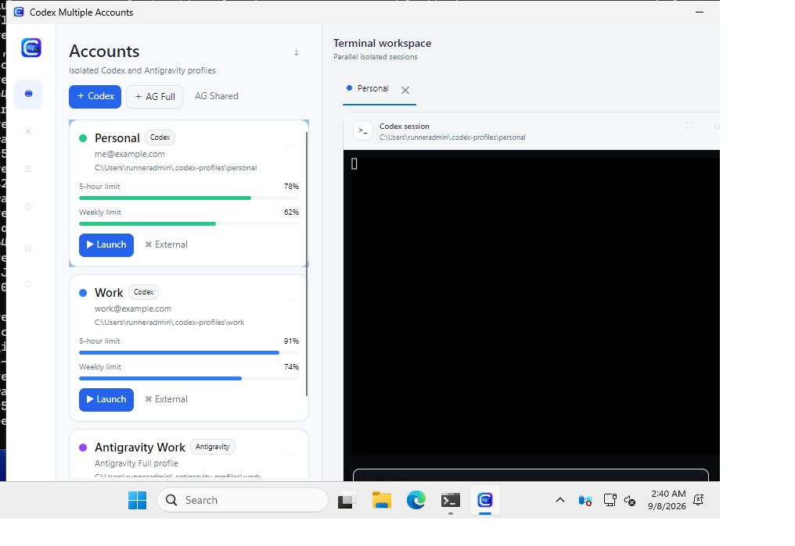

# Codex Multiple Accounts

Cross-platform Avalonia manager for running isolated Codex profiles and parallel Antigravity filesystem profiles.

<p align="center">
  
</p>

## Providers

### Codex

- **Isolated launch**: every profile owns a separate Codex home and each child `codex` process receives its own `CODEX_HOME`. Multiple profiles can therefore run concurrently without swapping the parent/global environment.
- **Activate globally**: explicitly promotes a selected Codex profile into the normal `~/.codex` home for editor integrations, backing up the previous default state first.
- Embedded PTY and external-terminal launch remain available.

### Antigravity

Antigravity profiles launch the desktop application with a child-only profile environment. Windows redirects `USERPROFILE`, `APPDATA`, and `LOCALAPPDATA`; Linux redirects `HOME` plus XDG directories and passes dedicated user-data/extensions directories; macOS redirects `HOME` and passes dedicated user-data/extensions directories.

The app tracks Antigravity processes per profile for the current manager session and exposes Start/Stop/Restart controls.

> **Authentication boundary:** current Antigravity versions use a fixed OS credential-store identity. Filesystem profiles can run in parallel, but they are not guaranteed to hold independent logged-in Antigravity accounts under the same OS user. The UI reports this limitation instead of claiming full auth isolation.

`Full` profiles are the supported isolation mode in this slice. `Shared` profile metadata is present for the next implementation slice; cross-platform settings/extensions sharing still requires safe symlink/junction handling.

Set `ANTIGRAVITY_EXECUTABLE` to override executable auto-detection. Defaults are `%LOCALAPPDATA%\Programs\Antigravity\Antigravity.exe` on Windows, `/Applications/Antigravity.app/Contents/MacOS/Antigravity` on macOS, and `/usr/bin/antigravity` or `/opt/Antigravity/antigravity` on Linux with a PATH fallback.

## Platforms

Windows, Linux and macOS. Codex uses the embedded PTY or an external terminal. Antigravity launches as an external desktop process with provider-specific isolation.

## Build

```bash
dotnet restore CodexMultipleAccounts.slnx
dotnet build CodexMultipleAccounts.slnx
dotnet run --project src/CodexMultipleAccounts.App
```

## Screenshot

The checked-in screenshot is captured from the real Avalonia application by the Windows **App Screenshot** workflow using a deterministic demo state. The workflow also uploads the PNG as an Actions artifact and refreshes `docs/assets/app-screenshot.png` when the app UI changes.

## Security

Profile directories can contain provider-managed authentication and application state. Treat the application-data `CodexMultipleAccounts/profiles` directory as sensitive. The manager never inspects or logs token contents, and child launch environment changes do not mutate the parent process environment.
